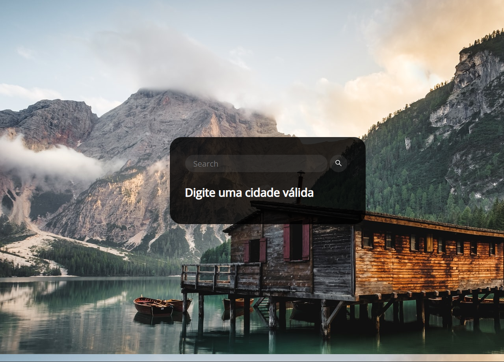

# Weather-App

O Weather App foi um programa que fiz querendo mesclar o Django ao Web Scraping. Sei que é possível e é bem melhor usar uma API, mas, eu escolhi o Web Scraping pois é algo que eu tenho muita experiencia e gostaria de mesclar essas duas tecnologia.

O HTML e CSS peguei na Internet.

[https://github.com/DenverCoder1/weather-app-tutorial](https://github.com/DenverCoder1/weather-app-tutorial)

Lógica do Programa:

Foi usado as bibliotecas;

- Requests
- BeautifulSoup

O programa basicamente pega pesquisa o que foi colocado na barra de pesquisar e raspo as informações do Google e coloco no HTML.
